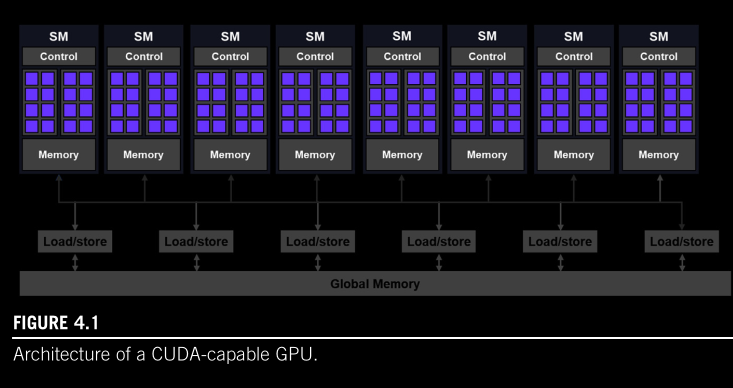
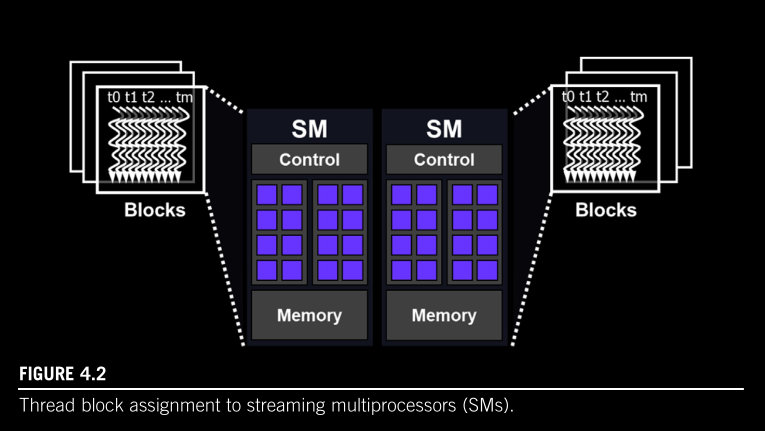
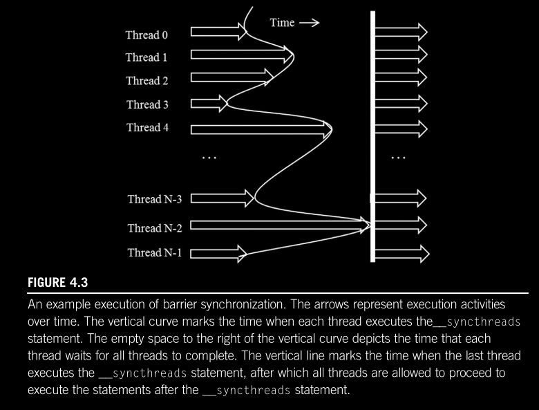

## Chapter 04 - GPU Architecture and Scheduling

- GPU architecture is organized into an array of highly threaded streaming multiprocessors (SMs)

- Each SM has several processing units called streaming processors or CUDA cores (or just cores)

- Each SM has its own control and on-chip memory (which differs from global memory or VRAM)

### Block Assignment

- Multiple blocks are likely to be simultaneously assigned to the same SM

- However, blocks need to reserve hardware resources to execute, so only a limited number of blocks can be simultaneously assigned to a given SM

- There's a limit on the total number of blocks that can be simulteneously executing in a CUDA device

- The assignment of threads to SMs on a block-by-block basis guarantees that threads in the same block are scheduled simultaneously on the same SM

- This makes it possible for threads in the same block to interact with each other in ways that threads across different blocks can't.

### Synchronization and Transparent Scalability

- CUDA allows threads in the same block to coordinate activities using barrier sync func `__syncthreads()`

