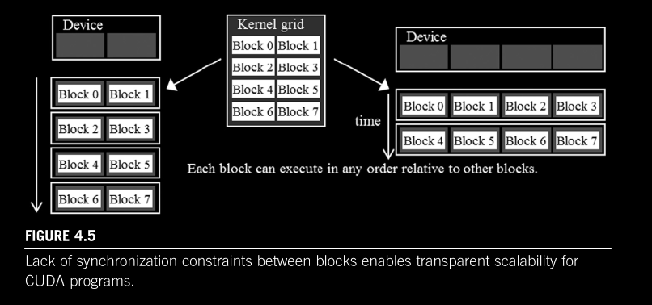
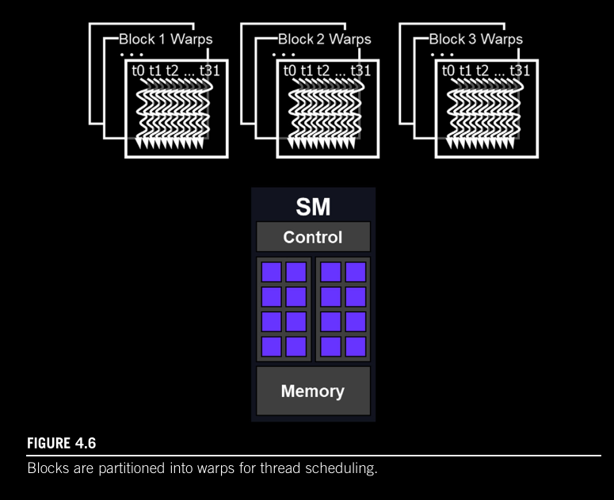
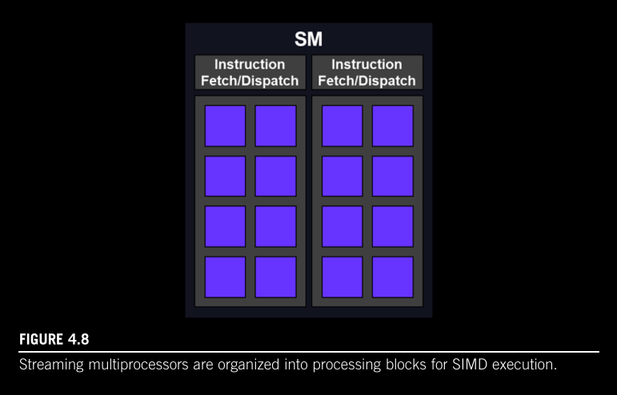
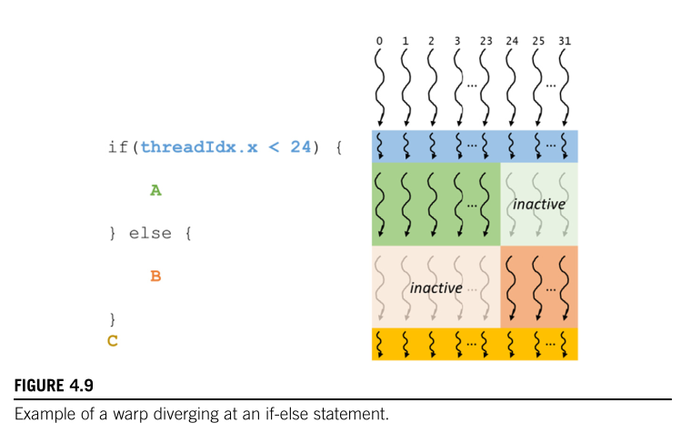

## Chapter 04 - GPU Architecture and Scheduling

### GPU Architecture Overview

- GPU architecture is organized into an array of highly threaded **Streaming Multiprocessors (SMs)**

- Each SM contains several processing units called:
  - Streaming Processors
  - CUDA Cores (or simply "cores")

- Each SM has its own:
  - Control unit
  - On-chip memory (distinct from global memory/VRAM)


---

### Block Assignment

- **Multiple blocks** are likely to be simultaneously assigned to the same SM

- Blocks require hardware resources to execute, so only a **limited number** of blocks can be simultaneously assigned to any given SM

- There's a limit on the total number of blocks that can simultaneously execute on a CUDA device

- Assignment of threads to SMs occurs on a **block-by-block basis**, guaranteeing that:
  - All threads in the same block are scheduled simultaneously
  - All threads in the same block execute on the same SM
  
- This enables threads within a block to interact in ways that threads across different blocks cannot


---

### Synchronization and Transparent Scalability

#### Barrier Synchronization

- CUDA allows threads in the same block to coordinate activities using the barrier synchronization function: **`__syncthreads()`**

- **Important**: `__syncthreads()` must be executed by **all** threads in a block


#### Correct Usage Rules

- If `__syncthreads()` is placed within an `if` statement, either:
  - **All** threads in a block execute the path that includes `__syncthreads()`, OR
  - **None** of them do

#### Incorrect Usage Example

```c
void incorrect_barrier_example(int n) {
    // ...existing code...
    if (threadIdx.x % 2 == 0) {
        // ...existing code...
        __syncthreads();
    } else {
        // ...existing code...
        __syncthreads();
    }
}
```

⚠️ **Why this is wrong**: The code above violates the rule that all threads must execute `__syncthreads()` at the same program point. This results in **undefined behavior**.

- In general, incorrect usage of barrier synchronization can result in:
  - Incorrect results
  - Deadlock

#### Transparent Scalability

The trade-off of **not allowing** barrier synchronization between different blocks enables **transparent scalability**:

**If blocks could synchronize with each other:**
- The runtime would need to schedule all blocks that require synchronization at the same time
- This would require enormous resources
- It would limit how the GPU could execute your code

**By preventing inter-block synchronization:**
- Blocks become completely independent execution units
- The runtime can:
  - Execute blocks in any order (e.g., Block 0 → Block 1, or Block 5 → Block 2)
  - Execute any number of blocks simultaneously based on available resources
  - Run the same kernel on both low-end and high-end GPUs

**Example from the figure:**
- **Left side (low-cost GPU)**: Only 2 blocks execute simultaneously due to limited execution resources (SMs, registers, shared memory)
- **Right side (high-end GPU)**: 4 blocks execute simultaneously thanks to greater available resources



---

- transparent scalability is a characteristic of being able to execute the same application program on different hardware, but with zero changes in the code

#### Wards and SIMD hardware

- Conceptually, one should assume that threads in a block can execute in any order with respect to each other.

- Once a block has been assigned to an SM, it is further divided into 32-thread units called `warps`

- The size of warps is implementation specific and can vary in future generations of GPUs.

- A `warp` is the unit of thread scheduling in SMs

- Each of the three blocks below are divided into warps for scheduling purposes

- Each warp consists of 32 threads of consecutive `threadIdx` values: threads 0-31 form the first warp, 32-63 form the second warp, and so on.  

- warps have a **fixed size of 32**

- to calculate number of warps in an SM: a block with 256 threads will have 256/32 = 8 warps. With three blocks in the SM: 8 x 3 = 24 warps

- For a block whose size is not a multiple of 32, the last warp will be padded with inactive threads to fill up the 32 thread positions. E.g. if a block has 48 threads, it will be partitioned into two warps, and the second warp will be padded with 16 inactive threads



- For blocks that consist of multiple dimensions of threads, the dimensions will be projected into a linearized row-major layout before partitioning into warps




#### Control Divergence

- threads in the same warp that follow different execution paths exhibit `control divergence`
- for an if-else construct, if some threads in a warp follow the if-path while others follow the else path, the hardware will take two passes. 

- One pass executes the threads that follow the if-path, and the other executes the threads that follow the else-path
- During each pass, the threads that follow the other path are not allowed to take effect.




#### Warp Scheduling and Latency Tolerance

- SMs only have limited execution units or cores to execute a subset of all threads assigned to it at any point in time
- In more recent designs, each SM can execute instructions for a small number of warps at any given point in time
- Assigning so many warps to an SM even though it can only execute a subet is how GPUs tolerate long-latency operations such as global memory accesses.

- I.e. The SM schedules many more warps than it can execute at once so that when one warp hits a 'red light' (waiting for data from VRAM), it can switch to a 'ready' warp in zero clock cycles, ensuring the math units never sit idle.

- The GPU achieves zero-cycle / zero-overhead switching through a "brute force" hardware strategy: The SM never moves the data. It's able to achieve this by having the resgisters and local state of every single assigned warp physically stored on the chip at the same time

  - On a CPU: There is only one set of registers. To switch tasks, you must "write down" the current state to RAM and "read in" the new state
  - On a GPU: The SM has a massive Register File. When a Block is assigned to an SM, the hardware carves out a permanent slice of registers for those threads. They stay there until the Block is completely finished

- The mechanism of filling latency time of operations from some threads with work from other threads is often called `latency tolerance` or `latency hiding`

- Recall:
  - Each block has a fixed-limit of 1,024 threads, regardless of x, y, z dimension
  - A warp also has a fixed-limit of 32 threads

- These constraints are the reason why an SM can fit all assigned blocks to it.
- An SM contains 65,536 (64K) 32-bit registers (in modern GPUs). The SM will throw an error if it can't fit all states of a block/warp

- Additionally, it's difficult to double the threads per block as it increases hardware complexity and timing considerations. E.g. `__syncthreads()` for 1,024 threads is manageable; managing it for 10,000 threads would require a massive amount of "wait logic" circuitry that would take up space better used for math unit

- For latency tolerance to be effective, it is desirable for an SM to have many more threads assigned to it than can be simultaneously supported with its execution resources to maximize the chance of finding a warp that is ready to execute at any point in time


#### Resource Partitioning and Occupancy